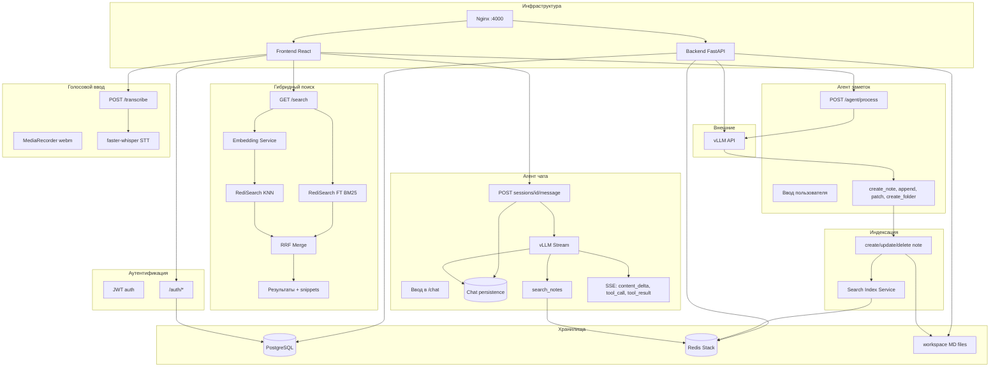

# AI Notes

**Умный менеджер заметок с голосовым вводом и LLM-агентом**, который организует заметки по смыслу. Пишите или говорите — агент поместит каждую заметку в нужную папку или добавит к существующей. Web-приложение + Android (Capacitor).

## Архитектура




## Стек

- **Frontend:** React 18, Vite, TailwindCSS, react-markdown, CodeMirror 6, Zustand, TanStack Query, Framer Motion
- **Backend:** FastAPI, SQLAlchemy 2 async, PostgreSQL 16, Redis, JWT auth, faster-whisper (STT), sentence-transformers (эмбеддинги), httpx (клиент vLLM)
- **Mobile:** Capacitor 6, Android
- **Инфра:** Docker Compose, Nginx

## Требования

- Docker и Docker Compose
- Запущенный vLLM-сервер (например Qwen3 с tool-calling) — опционально для функций агента

## Быстрый старт

1. Скопируйте env и задайте значения:
  ```bash
   cp .env.example .env
   # Отредактируйте .env: SECRET_KEY, DATABASE_URL, VLLM_BASE_URL (если используете агента)
  ```
2. Запустите стек:
  ```bash
   docker compose up -d
  ```
3. Откройте [http://localhost:4000](http://localhost:4000)

## Конфигурация


| Переменная         | Описание                                                              |
| ------------------ | --------------------------------------------------------------------- |
| `DATABASE_URL`     | Строка подключения к PostgreSQL                                       |
| `SECRET_KEY`       | Ключ подписи JWT (`openssl rand -hex 32`)                             |
| `VLLM_BASE_URL`    | Базовый URL vLLM API (например `http://host.docker.internal:8000/v1`) |
| `VLLM_MODEL`       | Имя модели                                                            |
| `WHISPER_MODEL`    | Модель faster-whisper (по умолчанию `distil-large-v3`)                |
| `WHISPER_LANGUAGE` | Язык транскрипции (по умолчанию `ru`)                                 |
| `CORS_ORIGINS`     | Разрешённые origins через запятую                                     |


## Возможности

- **Workspace:** Контент заметок хранится как Markdown-файлы в `workspace/{user_id}/{note_id}.md` (локальная папка, не БД)
- **Auth:** Регистрация / вход по JWT
- **Заметки:** Создание, редактирование, удаление; Markdown с превью; перетаскивание для изменения порядка
- **Папки:** Древовидная структура; заметки могут быть в папках или в корне
- **Агент:** Ввод пользователя отправляется в LLM, который решает — `create_note`, `append_to_note`, `create_folder` или `patch_note`; факты профиля влияют на выбор папки
- **Голос:** MediaRecorder → webm → faster-whisper → текст в поле ввода
- **Поиск:** Гибридный (векторный + по ключевым словам) через Redis; эмбеддинги для семантического поиска

## Разработка

Запуск бэкенда локально (нужны `.env` и Postgres):

```bash
cd backend
poetry install
alembic upgrade head
poetry run uvicorn app.main:app --reload
```

Запуск фронтенда с прокси на API:

```bash
cd frontend
npm install
npm run dev
```

## Android

Скрипт собирает фронтенд, копирует в `mobile/www` и собирает APK:

```bash
./scripts/build-android.sh              # debug APK
./scripts/build-android.sh --release    # release APK
```

Для release нужен `mobile/android/keystore.properties` (см. `keystore.properties.example`). Подробности — в [mobile/README.md](mobile/README.md).

## Лицензия

MIT